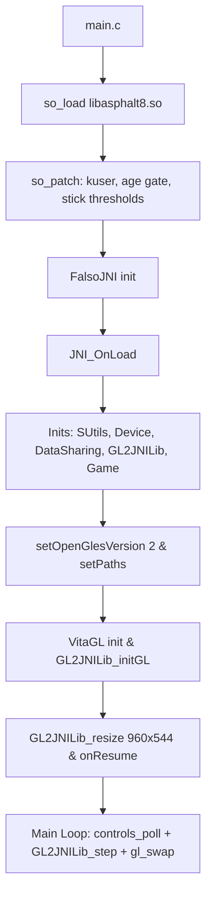
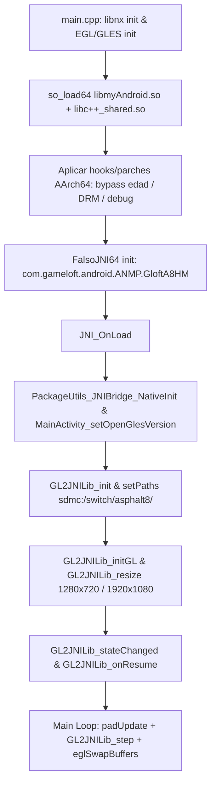

# Plan de Implementación: Port de Asphalt 8: Airborne para Nintendo Switch (AirborneNX)

## 1. Resumen Ejecutivo y Diagnóstico Técnico

El objetivo es portar **Asphalt 8: Airborne** a la consola **Nintendo Switch** utilizando como referencia arquitectónica el port existente para PlayStation Vita (v0.3), pero adaptándolo al juego en su versión **4.0.0l** compilada de forma nativa para **ARM64 (`arm64-v8a`)**.

### Comparativa de Entornos

| Componente | Port PS Vita (v2.0.0e) | Port Nintendo Switch (v4.0.0l) | Ventajas / Retos en Switch |
| :--- | :--- | :--- | :--- |
| **Arquitectura CPU** | ARMv7-A (32-bit, softfp) | ARMv8-A (AArch64, 64-bit) | Rendimiento nativo muy superior; sin necesidad de parches 32-bit (`kuser`, etc.). |
| **Binario del Juego** | `libasphalt8.so` (~25 MB) | `libmyAndroid.so` (~42.8 MB) + `libc++_shared.so` | Paquete renombrado a `com.gameloft.android.ANMP.GloftA8HM`. |
| **Carga Dinámica** | `so_util` (ELF32) | `so_util64` (ELF64 AArch64) | Manejo de reubicaciones AArch64 (`R_AARCH64_*`) y mapeo de memoria ejecutable vía `svcControlCodeMemory` / `virtmem`. |
| **Renderizado / GPU** | VitaGL (GLES2 sobre Sony GXM) | Mesa Nouveau (OpenGL ES 2.0/3.0 nativo + EGL) | Switch compila GLSL nativamente en hardware Tegra X1; elimina los hitches severos de shaders de Vita. |
| **Resolución Objetivo** | 816x462 o 960x544 (~30-55 FPS) | 1280x720 (Portátil) / 1920x1080 (Dock) (60 FPS fijos) | Escala dinámica o soporte nativo de resolución 720p/1080p. |
| **Subsistema Audio** | OpenSL ES emulado sobre `sceAudioOut` | OpenSL ES puenteado a `audren` (libnx) o SDL2 Audio | Soporte multicanal y latencia ultrabaja. |
| **Entrada / Controles** | Botones Vita + sticks emulando PowerA Moga HID | Joy-Cons / Pro Controller (libnx pad/hid) + Touch + Gyro | Controles completos con gatillos analógicos/digitales (ZL/ZR) y giroscopio SixAxis funcional. |
| **Almacenamiento** | `ux0:data/asphalt8/` (OBB sa2) | `sdmc:/switch/asphalt8/` (Estructura de archivos sueltos / JPK) | v4.0.0l ya utiliza assets descomprimidos en `files/` (JPK, shaders, modelos). |

---

## 2. Análisis del Flujo de Ejecución del Port de Vita vs. Switch

### Flujo Vita (v2.0.0e)


### Flujo Propuesto para Nintendo Switch (v4.0.0l)


---

## 3. Hoja de Ruta de Implementación en Etapas

### Etapa 1: Estructura del Proyecto y Toolchain de Compilación
* **Objetivo**: Configurar el entorno de compilación cruzada con devkitA64, libnx y CMake/Makefile.
* **Acciones**:
  1. Crear la estructura del proyecto `AirborneNX` (`src/`, `include/`, `lib/`, `data/`).
  2. Configurar el sistema de compilación (CMake con toolchain devkitA64 o Makefile basado en libnx/switch-examples).
  3. Vincular librerías base de Switch (`libnx`, `libEGL`, `libGLESv2`, `libglad`, `libdrm_nouveau`, `libz`).
  4. Generación automática del binario `.elf` y conversión a `.nro` con `elf2nro` y metadatos NACP (icono, título, versión).

### Etapa 2: Motor de Carga Dinámica AArch64 (`so_util64`)
* **Objetivo**: Cargar y reubicar en memoria de la Switch los binarios ELF64 (`libc++_shared.so` y `libmyAndroid.so`).
* **Acciones**:
  1. Implementar `so_util64` para Switch (soporte de segmentos `PT_LOAD`, tabla de símbolos dinámicos `DT_SYMTAB`, `DT_STRTAB`, `DT_RELA`).
  2. Implementar soporte para reubicaciones ARM64 esenciales:
     * `R_AARCH64_RELATIVE`
     * `R_AARCH64_GLOB_DAT`
     * `R_AARCH64_JUMP_SLOT`
     * `R_AARCH64_ABS64`
  3. Configurar la reserva de memoria ejecutable en Horizon OS mediante `svcControlCodeMemory` / `virtmem`.
  4. Ejecutar las funciones de inicialización estática (`DT_INIT_ARRAY`).

### Etapa 3: Capa de Compatibilidad de Sistema (Bionic libc & Android NDK)
* **Objetivo**: Resolver los 609 símbolos dinámicos requeridos por `libmyAndroid.so`.
* **Acciones**:
  1. **POSIX Pthreads**: Redirigir `pthread_create`, `pthread_mutex_*`, `pthread_cond_*` a la implementación de newlib/libnx.
  2. **Android Log**: Implementar `__android_log_print` y `__android_log_write` con salida a consola (`nxlink` / archivo log).
  3. **Android Asset Manager**: Adaptar la implementación de `AAssetManager_*` y `AAssetDir_*` del port de Vita para leer los assets del directorio de datos.
  4. **Native Window**: Proveer stubs de `ANativeWindow_*` vinculados a las dimensiones de la pantalla de la Switch.
  5. **Redirección de Rutas (I/O)**: Interceptar `fopen`, `open`, `stat`, `opendir` para mapear rutas Android (`/data/data/com.gameloft...` y `/sdcard/Android/data/...`) a `sdmc:/switch/asphalt8/`.

### Etapa 4: FalsoJNI para 64-bit y Paquete v4.0.0l
* **Objetivo**: Emular el entorno Java runtime y responder a todas las consultas JNI del juego.
* **Acciones**:
  1. Adaptar `FalsoJNI` para punteros de 64 bits (`uintptr_t` / `jobject` / `jmethodID`).
  2. Actualizar las firmas y nombres de clases al nuevo paquete:
     * De `com.gameloft.android.GAND.GloftA8HP` ➡️ a `com.gameloft.android.ANMP.GloftA8HM`.
  3. Registrar los métodos JNI requeridos por v4.0.0l:
     * `GL2JNILib`: `init`, `initGL`, `setPaths`, `resize`, `stateChanged`, `onResume`, `step`, `touchEvent`, `nativeSetPowerALeftJoystick`, etc.
     * `PackageUtils_JNIBridge`: `NativeInit`, `NativeKeyAction`, `NativeOnTouch`, `NativeSendKeyboardData`.
     * Información del dispositivo: Nombre ("Nintendo Switch"), Fabricante ("Nintendo"), Modelo ("OLED/Standard"), RAM (4096 MB), cores CPU (4).
     * Rutas internas y de caché hacia la tarjeta microSD.

### Etapa 5: Pipeline Gráfico (EGL + OpenGL ES 2.0 / 3.0 Nativo)
* **Objetivo**: Inicializar la GPU de la Switch y enlazar los comandos GLES2 del juego con el driver Nouveau/Mesa.
* **Acciones**:
  1. Inicializar el display EGL con `nouveau` / `switch-mesa`.
  2. Crear la superficie de renderizado nativa (1280x720 para modo portátil, con soporte de redimensionamiento a 1920x1080 para modo dock).
  3. Mapear las llamadas de `libmyAndroid.so` (`gl*` y `egl*`) directamente a la librería OpenGL de la Switch.
  4. Implementar el ciclo de presentación (`eglSwapBuffers`).

### Etapa 6: Subsistema de Audio (OpenSL ES Bridge)
* **Objetivo**: Proveer sonido y música en el juego sin retrasos ni pérdidas de paquetes.
* **Acciones**:
  1. Implementar la interfaz `slCreateEngine` y los interfaces de OpenSL ES:
     * `SL_IID_ENGINE`
     * `SL_IID_PLAY`
     * `SL_IID_BUFFERQUEUE`
     * `SL_IID_ANDROIDSIMPLEBUFFERQUEUE`
  2. Conectar el buffer de audio a la API nativa de audio de la Switch (`audren` vía libnx o backend de audio SDL2).
  3. Manejar frecuencia de muestreo nativa (44.1 kHz / 48 kHz).

### Etapa 7: Sistema de Entrada, Controles y Sensores
* **Objetivo**: Mapeo completo de controles para una experiencia de consola completa.
* **Acciones**:
  1. **Joy-Cons y Pro Controller**:
     * Mapear botones físicos (A/B/X/Y, D-Pad, L, R, ZL, ZR, Plus, Minus) a los eventos `KeyEvent` y `PowerA` de Gameloft.
     * Mapear palancas analógicas izquierda y derecha a `nativeSetPowerALeftJoystick` y `nativeSetPowerARightJoystick`.
     * Mapear gatillos ZL/ZR analógicos a `nativeSetPowerAL2R2MODEB`.
  2. **Pantalla Táctil**:
     * Capturar eventos multi-touch de libnx y redirigirlos a `GL2JNILib_touchEvent`.
  3. **Giroscopio (SixAxis)**:
     * Leer el sensor de movimiento de la Switch con `hid` / `sixaxis` y pasarlo a `GL2JNILib_accelerometerEvent` para permitir conducción por inclinación.
  4. **Teclado en Pantalla**:
     * Integrar el teclado del sistema de Switch (`swkbd`) para nombres de jugador y textos.

### Etapa 8: Parches de Ejecución y By-passes Específicos
* **Objetivo**: Evitar bloqueos de DRM, verificaciones de red iniciales o pantallas de edad.
* **Acciones**:
  1. **Age Gating**: Identificar el flujo de verificación de edad en v4.0.0l (métodos en `PackageUtils` o native) y forzar valor de adulto para saltar la pantalla web rota.
  2. **DRM / GDRMPolicy**: Enganchar `GDRMPolicy_nativeAllow` o `GDRMPolicy_processServer` para que siempre devuelvan éxito/permitido sin requerir conexión a servidores de Gameloft extintos.
  3. **Control de Frecuencia de Cuadros**: Asegurar VSync constante a 60 FPS.

---

## 4. Estructura de Archivos para la Nintendo Switch (`sdmc`)

```text
sdmc:/switch/asphalt8/
├── Asphalt8.nro                       # Binario ejecutable de Nintendo Switch
├── libmyAndroid.so                    # Biblioteca nativa ARM64 extraída del APK v4.0.0l
├── libc++_shared.so                   # C++ runtime ARM64
├── config.ini                         # Configuración (resolución, controles, debug)
├── files/                             # Directorio extraído de com.gameloft.../files
│   ├── GameOptions.jpk
│   ├── levels.jpk
│   ├── pvs.jpk
│   ├── track_ice.jpk
│   ├── track_nev.jpk
│   ├── track_tok.jpk
│   ├── shaders/
│   ├── models/
│   ├── textures_android/
│   └── sounds/
├── internal/                          # Datos de guardado y perfiles del jugador
└── cache/                             # Archivos temporales de shaders y texturas
```

---

## 5. Factores Críticos de Éxito y Mitigación de Riesgos

1. **Reubicaciones AArch64 complejas**:
   * *Riesgo*: `libmyAndroid.so` utiliza `RELA` con más de 140,000 entradas de reubicación relativa.
   * *Mitigación*: Utilizar un procesador de reubicaciones eficiente y optimizado en `so_util64` para que el tiempo de arranque sea inferior a 2-3 segundos.
2. **Dependencias de C++**:
   * *Riesgo*: Desajuste de símbolos entre la libc++ de Android y newlib de devkitA64.
   * *Mitigación*: Cargar directamente `libc++_shared.so` en memoria antes de `libmyAndroid.so` y resolver sus símbolos primero.
3. **Mapeo de Rutas de Archivos**:
   * *Riesgo*: Archivos que no se encuentran porque el juego intenta buscar en `/sdcard/Android/...`.
   * *Mitigación*: Hookear todas las funciones de I/O (`fopen`, `stat`, `access`, etc.) con un normalizador estricto de rutas.
